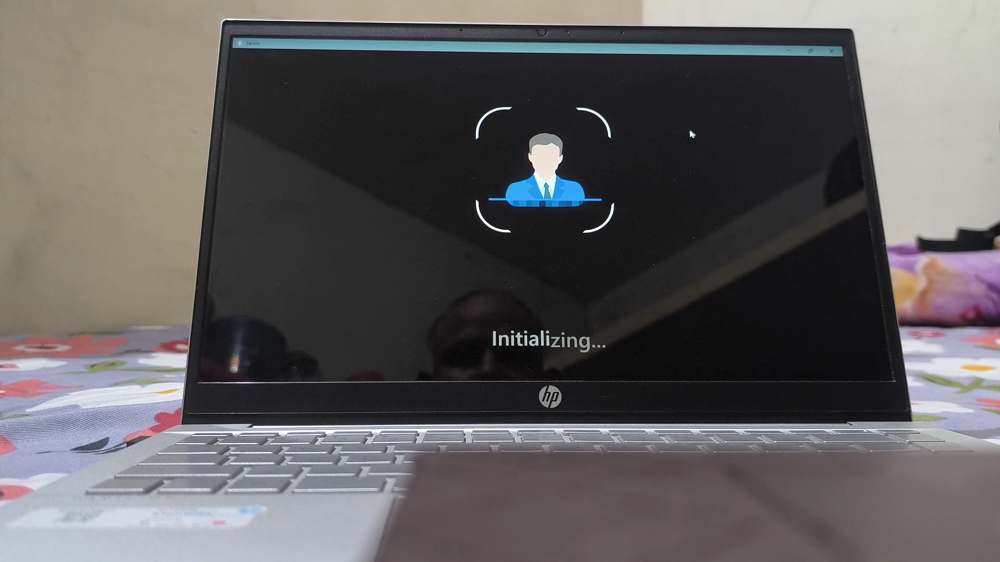
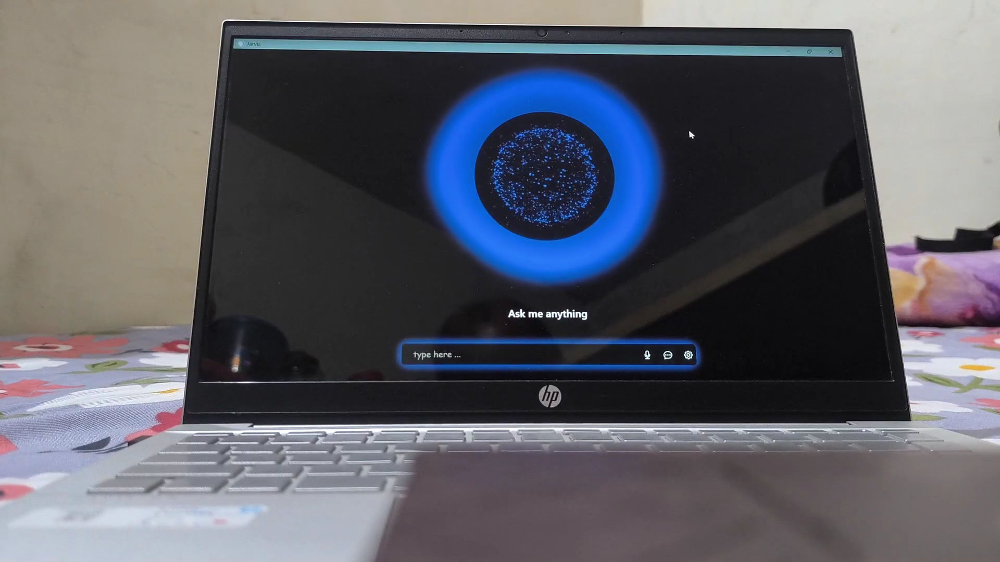
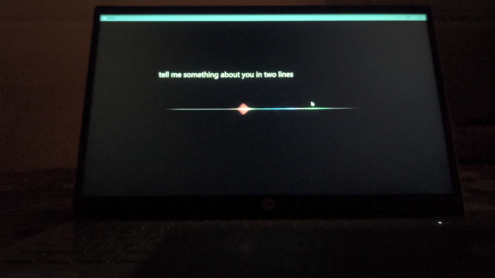
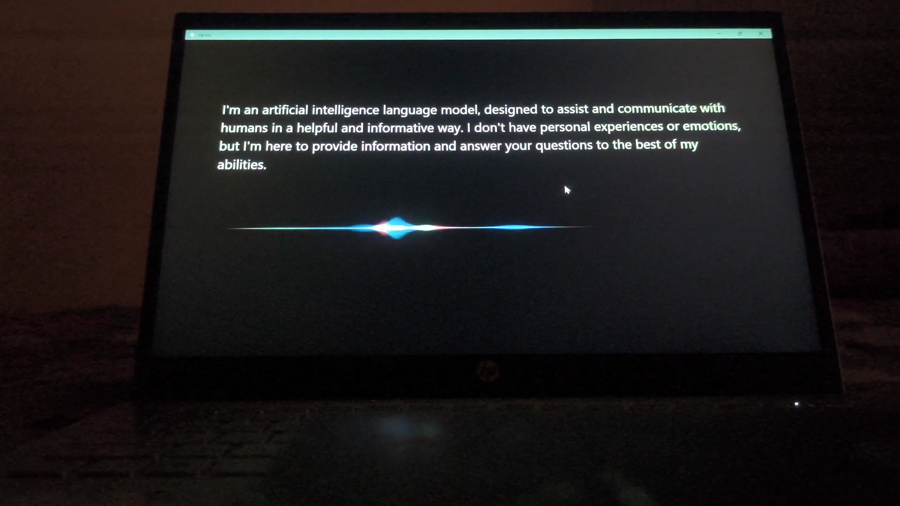

# 🧠 Jarvis - AI Voice Assistant

Jarvis is a powerful, multilingual AI-based desktop assistant built using Python.
It can perform real-time voice interactions, respond smartly, authenticate using facial recognition, and assist users with various tasks – just like your own personal assistant.

### 📽️ [Watch the YouTube Demo](https://www.youtube.com/watch?v=qUFTJay_eqY)


---

## 🚀 Features

- 🔐 **Face Authentication** – Only you can access Jarvis.
- 🗣️ **Hotword Detection** – Say the wake word to activate Jarvis.
- 🎙️ **Voice Command Support** – Talk to Jarvis and get smart replies.
- 📲 **WhatsApp Automation** – Send messages using your voice.
- 📱 **Android Integration** – Call & message via ADB.
- 🔗 **YouTube Play** – Just say and it plays.
- 🧠 **Chatbot Mode** – Get intelligent replies.
- 💬 **Multilingual Input** – Talk in Hindi, English, or Hinglish.

---

## 🖼️ Demo Screens

### 🔐 Face Authentication


### 🏠 Home Screen


### 🎧 Listening Mode


### 🎤 Voice Command Given


### 🤖 AI Response


---

## 🛠️ How to Run

```bash
# Clone this repository
git clone https://github.com/lokendra-24/jarvis-main.git

# Navigate to project
cd jarvis-main

# Install dependencies
pip install -r requirements.txt

# Run the assistant
python run.py
